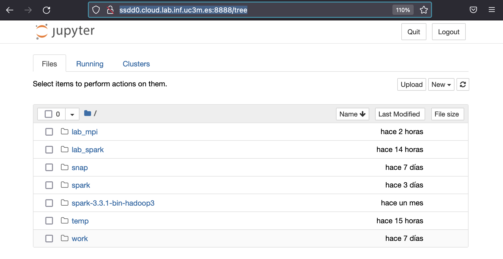
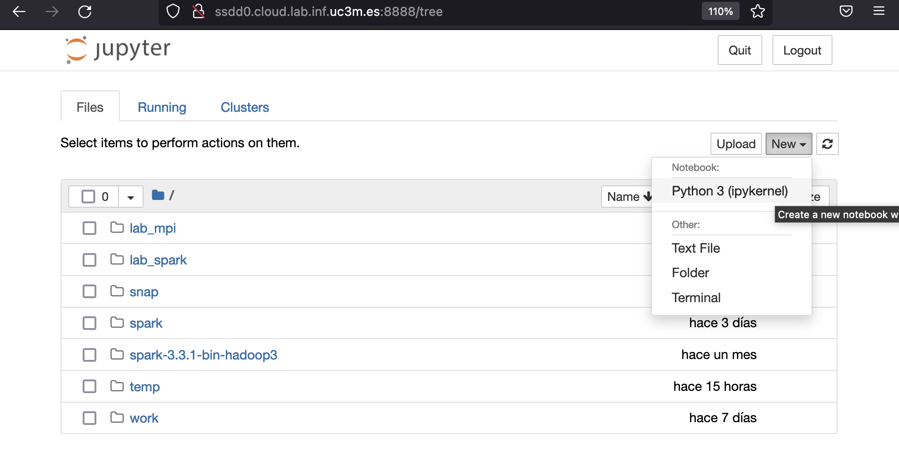
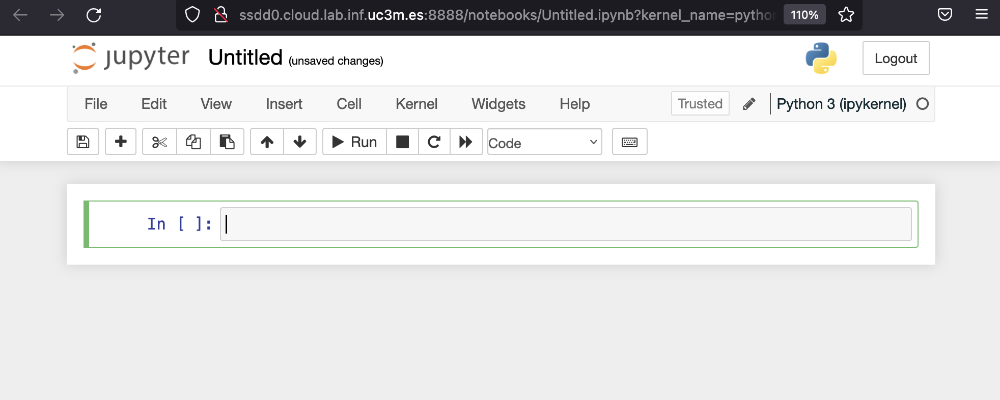
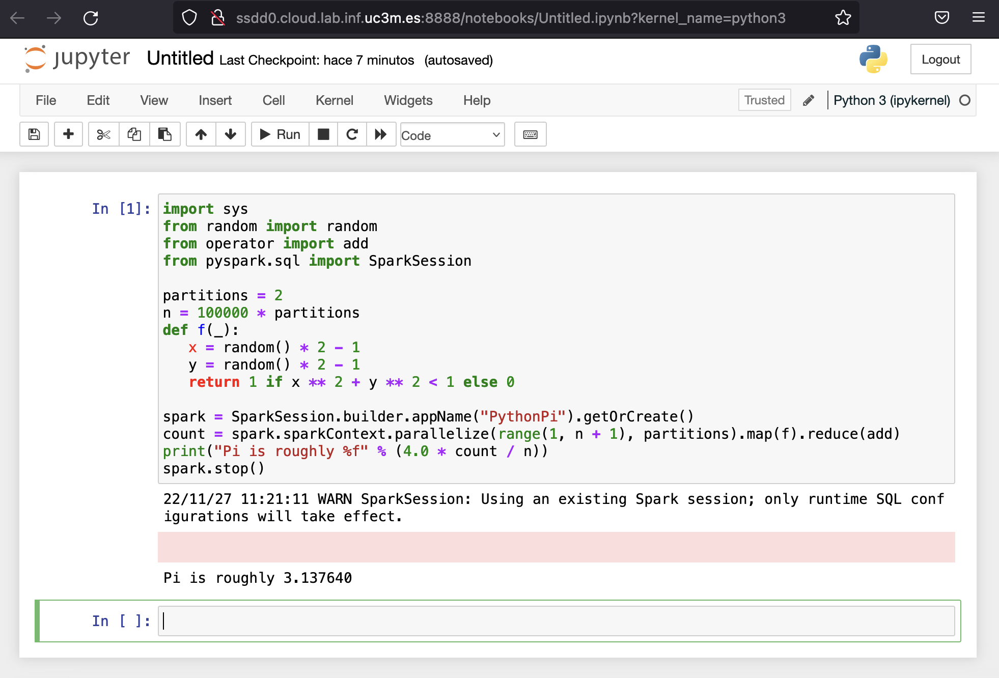
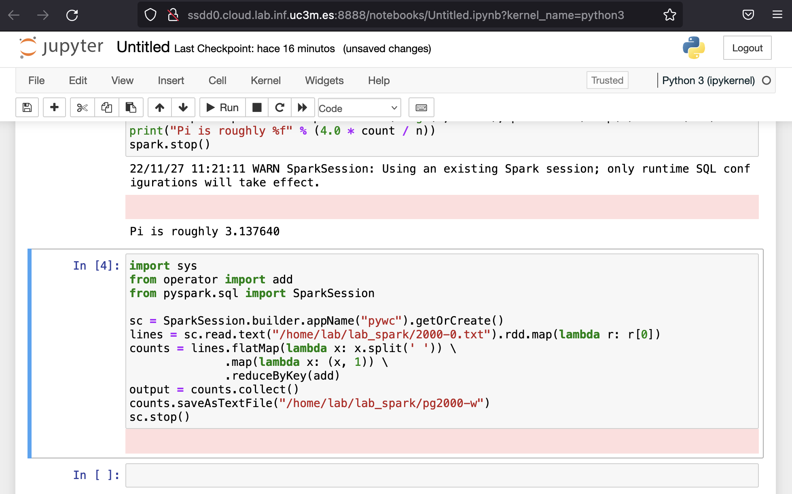
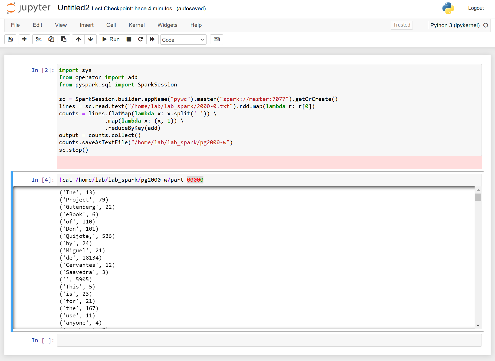

# Sistemas Paralelos y Distribuidos

&nbsp;&nbsp; [](https://www.gnu.org/licenses/lgpl-2.1)
&nbsp; 
&nbsp; 


## Laboratorio sobre Alta Escalabilidad en Sistemas Distribuidos

* Máquinas de trabajo:
  * Opción 1: [Sistema dedicado en la nube cloud.lab.inf.uc3m.es](/materiales/ENV_cloud.md)
  * Opción 2: [Sistema propio usando contenedores docker](/materiales/ENV_docker.md)
* Software necesario:
  * [Instalación de Apache Spark](/materiales/SW_spark.md)
* Ejemplos para aprender:
  * [Apache Spark en nodo autónomo y shell interactivo](#apache-spark-en-nodo-aut%C3%B3nomo-y-shell-interactivo)
  * [Ejemplo: cálculo de pi en nodo autónomo y shell interactivo](#ejemplo-c%C3%A1lculo-de-pi-en-nodo-aut%C3%B3nomo-y-shell-interactivo)
  * [Ejemplo: contar ocurrencias de palabras en fichero autónomo y shell interactivo](#ejemplo-contar-ocurrencias-de-palabras-en-fichero-en-nodo-aut%C3%B3nomo-y-shell-interactivo)
  * [Ejemplo: uso de jupyter notebook](#ejemplo-uso-de-jupyter-notebook)
  * [Ejemplo: uso de jupyter notebook con cluster](#ejemplo-uso-de-jupyter-notebook-con-cluster)


## Ejemplos para aprender

### Apache Spark en nodo autónomo y shell interactivo

* Para trabajar con un shell interactivo en un nodo autónomo hay que ejecutar:
  ```
  ./spark/bin/pyspark  --master local[2]
  ```
  Donde el parámetro de "--master" puede ser:
  * local     -> 1 hilo
  * local[N]  -> N hilos
  * local[\*] -> tantos hilos como cores haya en el sistema (```nproc --all```)


* Tras ejecutar pyspark como se ha indicado anteriormente, la salida debería ser parecida a:
  ```
  Python 3.12.3 (main, Jun 18 2025, 17:59:45) [GCC 13.3.0] on linux
  Type "help", "copyright", "credits" or "license" for more information.
  WARNING: Using incubator modules: jdk.incubator.vector
  Using Spark's default log4j profile: org/apache/spark/log4j2-defaults.properties
  Setting default log level to "WARN".
  To adjust logging level use sc.setLogLevel(newLevel). For SparkR, use setLogLevel(newLevel).
  25/07/13 10:26:34 WARN NativeCodeLoader: Unable to load native-hadoop library for your platform... using builtin-java classes where applicable
  Welcome to
        ____              __
       / __/__  ___ _____/ /__
      _\ \/ _ \/ _ `/ __/  '_/
     /__ / .__/\_,_/_/ /_/\_\   version 4.0.0
        /_/

  Using Python version 3.12.3 (main, Jun 18 2025 17:59:45)
  Spark context Web UI available at http://55c02d4925b5:4040
  Spark context available as 'sc' (master = local[2], app id = local-1755080795247).
  SparkSession available as 'spark'.
  >>>
  ```

* Cuando tengamos que terminar la sesión de trabajo de Apache Spark deberemos ejecutar:
  ```
  quit()
  ```
  También el caracter "final de fichero" (con las teclas control y D) debería de permitir finalizar la sesión con Apache Spark.


### Ejemplo: cálculo de pi en nodo autónomo y shell interactivo

* Para trabajar con un shell interactivo en un nodo autónomo hay que ejecutar:
  ```
  ./spark/bin/pyspark  --master local[*]
  ```

* Spark imprime ">>>" para indicarnos que está a la espera de código Python para ejecutar.
  Vamos a copiar el siguiente código en la terminal:
  ``` python
  import sys
  from random import random
  from operator import add
  from pyspark.sql import SparkSession

  partitions = 2
  n = 100000 * partitions
  def f(_):
     x = random() * 2 - 1
     y = random() * 2 - 1
     return 1 if x ** 2 + y ** 2 < 1 else 0

  spark = SparkSession.builder.appName("PythonPi").getOrCreate()
  count = spark.sparkContext.parallelize(range(1, n + 1), partitions).map(f).reduce(add)
  print("Pi is roughly %f" % (4.0 * count / n))
  spark.stop()
  ```

* Tras introducir el código y dar enter se ejecutará, y la salida debería ser parecida a:
  ```
  >>> import sys
  >>> from random import random
  >>> from operator import add
  >>> from pyspark.sql import SparkSession
  >>>
  >>> partitions = 2
  >>> n = 100000 * partitions
  >>> def f(_):
  ...    x = random() * 2 - 1
  ...    y = random() * 2 - 1
  ...    return 1 if x ** 2 + y ** 2 < 1 else 0
  ...
  >>> spark = SparkSession.builder.appName("PythonPi").getOrCreate()
  25/07/13 10:28:40 WARN SparkSession: Using an existing Spark session; only runtime SQL configurations will take effect.
  >>> count = spark.sparkContext.parallelize(range(1, n + 1), partitions).map(f).reduce(add)

  >>> print("Pi is roughly %f" % (4.0 * count / n))
  Pi is roughly 3.141240
  >>> spark.stop()
  >>>
  ```

* Para terminar la sesión ejecutaremos:
  ```
  quit()
  ```


### Ejemplo: contar ocurrencias de palabras en fichero en nodo autónomo y shell interactivo

* Usaremos el quijote en texto plano para trabajar ([pg2000.txt](https://www.gutenberg.org/files/2000/2000-0.txt)) para lo que usaremos:
  ```
  mkdir -p /home/lab/temp
  curl https://www.gutenberg.org/files/2000/2000-0.txt  -o /home/lab/temp/2000-0.txt
  ```

* Deberemos borrar cualquier resultado anterior de trabajo:
  ```
  rm -fr   /home/lab/temp/pg2000-w
  ```

* Para trabajar con un shell interactivo en un nodo autónomo hay que ejecutar:
  ```
  ./spark/bin/pyspark  --master local[*]
  ```

* Spark imprime ">>>" para indicarnos que está a la espera de código Python para ejecutar.
  Vamos a copiar el siguiente código en la terminal:
  ``` python
  import sys
  from operator import add
  from pyspark.sql import SparkSession

  sc = SparkSession.builder.appName("pywc").getOrCreate()
  lines = sc.read.text("/home/lab/temp/2000-0.txt").rdd.map(lambda r: r[0])
  counts = lines.flatMap(lambda x: x.split(' ')).map(lambda x: (x, 1)).reduceByKey(add)
  output = counts.collect()
  counts.saveAsTextFile("/home/lab/temp/pg2000-w")
  sc.stop()
  ```

* Tras introducir el código y dar enter se ejecutará, y la salida debería ser parecida a:
  ```
  >>>
  >>> import sys
  >>> from operator import add
  >>> from pyspark.sql import SparkSession
  >>>
  >>> sc = SparkSession.builder.appName("pywc").getOrCreate()
  >>> lines = sc.read.text("/home/lab/temp/2000-0.txt").rdd.map(lambda r: r[0])
  >>> counts = lines.flatMap(lambda x: x.split(' ')).map(lambda x: (x, 1)).reduceByKey(add)
  >>> output = counts.collect()
  >>> counts.saveAsTextFile("/home/lab/temp/pg2000-w")
  >>> sc.stop()
  >>>
  ```

* Para terminar la sesión ejecutaremos:
  ```
  quit()
  ```

* Para ver el resultado ejecutaremos:
  ```
  cat /home/lab/temp/pg2000-w/part-00000
  ```


### Ejemplo: uso de jupyter notebook

* Debemos configurar pyspark para que use jupyter y notebook:
  ```
  export PATH=$HOME/spark/bin:$PATH
  export PYSPARK_DRIVER_PYTHON=jupyter
  export PYSPARK_DRIVER_PYTHON_OPTS='notebook --ip=0.0.0.0 --no-browser'
  ```

* A continuación debemos ejecutamos *pyspark*:
  ```
  pyspark
  ```

* En la salida de la ejecución de *pyspark* debemos buscar la URL en la que conectarnos:
  ```
  [I 10:44:44.828 NotebookApp] Writing notebook server cookie secret to /home/lab/.local/share/jupyter/runtime/notebook_cookie_secret
  [I 10:44:44.920 NotebookApp] Serving notebooks from local directory: /home/lab
  [I 10:44:44.920 NotebookApp] Jupyter Notebook 6.4.12 is running at:
  [I 10:44:44.920 NotebookApp] http://55c02d4925b5:8888/?token=0bc4858e899e6db5f8d6f75cc29b99baa3a9c34c43a00f4d
  [I 10:44:44.920 NotebookApp]  or http://127.0.0.1:8888/?token=0bc4858e899e6db5f8d6f75cc29b99baa3a9c34c43a00f4d
  [I 10:44:44.920 NotebookApp] Use Control-C to stop this server and shut down all kernels (twice to skip confirmation).
  [C 10:44:44.921 NotebookApp]

      To access the notebook, open this file in a browser:
          file:///home/lab/.local/share/jupyter/runtime/nbserver-2778-open.html
      Or copy and paste one of these URLs:
          http://master:8888/?token=0bc4858e899e6db5f8d6f75cc29b99baa3a9c34c43a00f4e
       or http://127.0.0.1:8888/?token=0bc4858e899e6db5f8d6f75cc29b99baa3a9c34c43a00f4e
  ```

* Para conectarnos debemos usar el nombre de la máquina *master* visible en nuestra red, en nuestro caso hay que cambiar *master* por *ssddX.cloud.lab.inf.uc3m.es*:
  ```
  http://ssdd0.cloud.lab.inf.uc3m.es:8888/?token=0bc4858e899e6db5f8d6f75cc29b99baa3a9c34c43a00f4e
  ```

* Una vez conectados+as estaremos en la página inicial:
  

* En la página inicial procederemos a crear un nuevo notebook:
  

* En el nuevo libro tendremos una nueva celda:
  

* En la celda podemos copiar el ejemplo de PI (y ejecutarlo):
  

* En una nueva celda podemos copiar el ejemplo de contar el número de palabras en local (y ejecutarlo):
  

* En una nueva celda podemos copiar el ejemplo de contar el número de palabras en remoto (y ejecutarlo):
  


### Ejemplo: uso de jupyter notebook con cluster

* Se configura los workers de Spark:
  ```
  echo "nodo1" >> spark/conf/workers
  echo "nodo2" >> spark/conf/workers
  ```

* Todos los nodos han de poder comunicarse con SSH sin precisar clave.
  En caso de ser necesario, hay que ejecutar:
  ```
  ssh-keygen -t rsa -P ""
  ssh-copy-id -i .ssh/id_rsa.pub lab@nodo1
  ssh-copy-id -i .ssh/id_rsa.pub lab@nodo2
  ```
  Se recomienda este [tutorial de IBM](https://www.ibm.com/support/pages/configuring-ssh-login-without-password) para más información al respecto de este paso.

* Si no hay una cuenta compartida en todos los nodos entonces hay que asegurarse que se tiene la misma copia de Spark en todos los nodos mediante:
  ```
  scp –r spark lab@nodo1:~/
  scp –r spark lab@nodo2:~/
  ```

* En el nodo master hay que arrancar *Spark*:
  ```
  ./spark/sbin/start-all.sh
  ```

* Recuerde antes tener borrado el directorio $HOME/temp/pg2000-w que pueda tener alguna ejecución previa:
  ```
  rm -fr $HOME/temp/pg2000-w
  ```

* El programa cambia solo añadiendo ".master("spark://master:7077")" en nuestro ejemplo:
  ```
  import sys
  from operator import add
  from pyspark.sql import SparkSession

  sc = SparkSession.builder.appName("pywc").master("spark://master:7077").getOrCreate()
  lines = sc.read.text("/home/lab/temp/2000-0.txt").rdd.map(lambda r: r[0])
  counts = lines.flatMap(lambda x: x.split(' ')) \
                .map(lambda x: (x, 1)) \
                .reduceByKey(add)
  output = counts.collect()
  counts.saveAsTextFile("/home/lab/temp/pg2000-w")
  sc.stop()
  ```
  El [tutorial](https://towardsdatascience.com/how-to-connect-jupyter-notebook-to-remote-spark-clusters-and-run-spark-jobs-every-day-2c5a0c1b61df) muestra un entorno parecido.

* Para terminar la sesión ejecutaremos:
  ```
  quit()
  ```

* Para ver el resultado ejecutaremos:
  ```
  cat /home/lab/temp/pg2000-w/part-00000
  ```

* En el nodo master cuando se termine la sesión de trabajo se para *Spark* usando:
  ```
  ./spark/sbin/stop-all.sh
  ```


## Bibliografía de ejemplos de Spark

* [Ejemplos iniciales de uso de Spark](https://spark.apache.org/examples.html)
* [Ejemplos en python](https://github.com/apache/spark/tree/master/examples/src/main/python)


